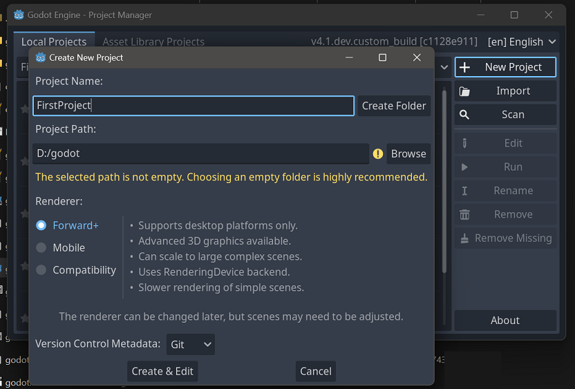
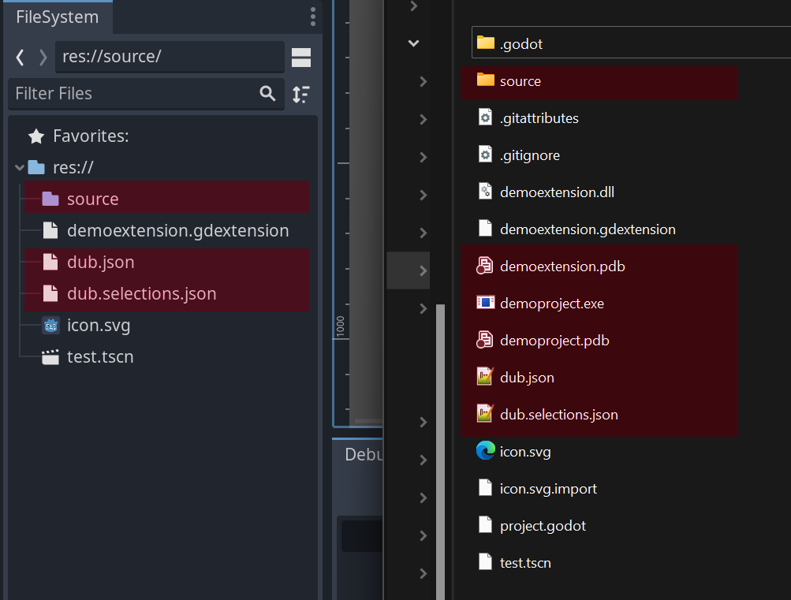
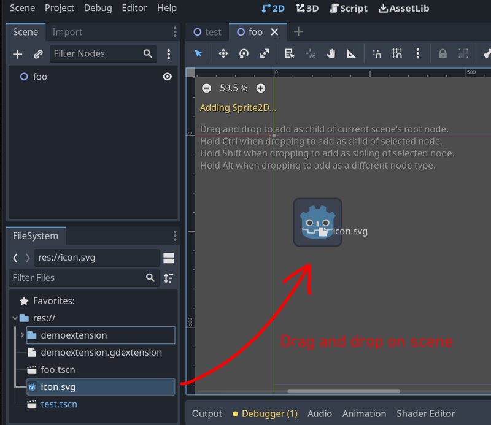
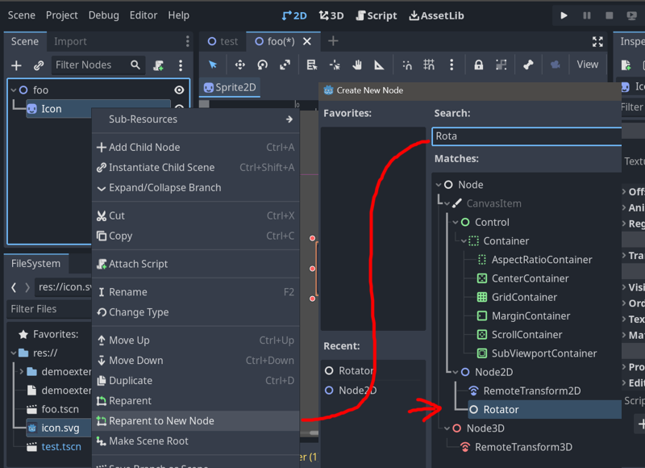

# Basic Example

Now that we have our environment set up we can start by manually creating a project and first game extension.

This step will demonstrate how godot and GDExtension works, and how godot-dlang extension is loaded.

What we are going to do in this capter:
* Create new empty godot project
* Create and configure GDExtension
* Implement basic node script that rotates around its axis

## Create new Godot project

If you have followed godot-dlang readme you should be already familiar with this step, but we will guide you anyway.

Let's create an empty Godot project, open Godot editor now, it will show project launcher window, choose `"New project"` on the side, fill in project name and location and hit `"Create & Edit"`, the project now should open up in the editor.



You can keep the editor open or close it, now we proceed to creating our first GDExtension.

## Creating our first GDExtension

Open up your project folder in terminal and let's create our first godot-dlang extension using terminal and your favorite text editor, we will be using VSCode for the rest of this tutorial.

In this example we will use nested D project folder per extension, and we will configure build rules to copy the resulting binary to a desired location. 
Such setup not necessarily is the best, as there will be tons of files in project explorer view.

Here is an illustration of a problem, on this screenshot godot project and D project files are mixed up. D project files highlighted in red.


Also note that by using dub there no way to copy only the .dll/.so files, as such you will see extra files from linker such .exp, .lib, .pdb, etc...

Another option would be to group everything inside another folder and place D project side-by-side with godot project, such setup is probably more suitable for complex projects with multiple extensions.

### Creating D project using dub

Now let's start with D project, run this in terminal inside godot project folder.
You will be prompted to fill some required data as well as extra dependencies, you can just hit enter for everything and add dependencies later.

So let's just run dub init and hit enter until it is done.
```sh
$ dub init demoextension
```
> Unlike the situation with screenshot above we created nested folder for D project, though the build system will still add some clutter, unfortunately.

Now step inside newly created demoextension dub project
```sh
$ cd demoextension
```

And add godot-dlang dependency using dub
```sh
$ dub add godot-dlang
```

Note that for now we will be using stable godot-dlang version from dub package registry.

### Editing project files with Visual Studio Code

Now go back one folder up back to godot project again and open it in VSCode.
Note that here we open the whole godot project and not just D extension.

```sh
$ cd ..
$ code .
```

> _If you are confused what are these dots - `cd ..` tells terminal to go up one folder, `code .` tells vscode to open current location._

Now we need to create new game object class, then we create and configure new godot extension.

Inside VSCode find and delete `source/app.d` file, and inside of source folder create new file `rotator.d`

In this demo project we will make simple script that rotates an object it is attached to indefinitely with a constant turn rate every frame.

Create a new file under `source` folder and name it `rotator.d`, paste in the following code:

__demoextension/source/rotator.d__
```d
module rotator;

import godot;
import godot.node2d;
import godot.engine;

class Rotator : GodotScript!Node2D
{
	@Method
	void _process(float delta)
	{
		if (Engine.isEditorHint)
			return;
	
		// we want our object to rotate slowly, about 5 degrees per second
		rotate(delta * deg2rad(5));
	}
}

  

mixin GodotNativeLibrary!(
	"demoextension",

	Rotator,
);
```

> We have extra check here that checks if we are running in the editor. Often your game code will manipulate objects on scene, while in this simple example it won't really hurt anything besides messing up rotation if you accidentally attach it to a wrong object, in more realistic use cases this might lead to immediate editor crash if your script do something wrong.

Before we build we need to change build target type to create dynamic library as GDExtension expects a dynamic library to be load and unload it at run time.

Open dub.json and add the targetType property after name, don't forget the comma after a name. We also added targetPath pointing up one level because we put our D project inside godot project and we need to copy dynamic library to godot project root.

```json
"targetName": "demoextension",
"targetType": "dynamicLibrary",
"targetPath": "../"
```

Note that we still specify target name for our outputs, this is because for some reason dub creates a targets with parent folder name, could be a code-d issue because we are using 'workspace' in VS Code.

This is how it should look like now, notice the last two lines

__demoextension/dub.json__:
```json
{
	"authors": [
		"username"
	],
	"copyright": "Copyright © 2023, username",
	"dependencies": {
		"godot-dlang": "~>0.2.0"
	},
	"description": "A minimal D application.",
	"license": "proprietary",
	"name": "demoextension",
	"targetName": "demoextension",
	"targetType": "dynamicLibrary",
	"targetPath": "../"
}
```

Now let's build our first extension.
Since we've in project root we can't run build from that location, so instead using Visual Studio terminal we will navigate again to our D project and do dub build.

First navigate to D project folder __inside VSCode terminal__.
```sh
$ cd demoextension
```

Now run the build, it **will fail** but that is expected and is normal. 
We might of course generate bindings beforehand to let it build succesfully, however our intent is to use custom working copy.

```sh
$ dub build
```

We need to edit dub.selections.json to tell dub use specific godot-dlang location instead of dub package registry version. 
It is a package version lock file that fixates used packages versions, normally it should be put under version control system unless you are working on public library.
Another problem is that we are dealing with local path here, which is complicates work process.

__demoextension/dub.selections.json__: Edit it to something like this
```json
{
	"fileVersion": 1,
	"versions": {
		"godot-dlang": { "path": "/home/username/godot-dlang" },
		"utf_bc": "0.2.1"
	}
}
```
> Note: on Windows you still have to use forward slash '/' in paths.

And now build it again, this time it should be properly configured and build without error.

```sh
$ dub build
```

Done, we should now have our first extension with newly created class ready to use, almost...

## Configuring GDExtension

Wondered why we opened Godot project root folder?
Now we need create extension description for Godot.

Create a new file inside godot project and fill with following content.

__demoextension.gdextension__:
```
[configuration]

entry_symbol = "demoextension_gdextension_entry"

[libraries]

linux.64 = "libdemoextension.so"
windows.64 = "demoextension.dll"
```

## Using our Rotator

Go back to godot, if you have it opened all this time you need to reload project using top menu bar `Project->Reload current project` button.

Now create new 2D scene, navigate to file browser panel on the left, drag svg icon on top of empty scene to create new sprite object, select `Icon` object in the scene tree on the left. 




Right click on that `Icon` object an choose attach to new parent, type in Rotator in search bar and confirm.



Move the `Rotator` node a bit away from top left corner, and reset `Icon` transform offset so it will rotate around its center and not some arbitrary point on scene.

Don't forget to save the scene.

Hit play button, and...

Oh no, look at our sprite, it is bugged!


https://user-images.githubusercontent.com/22953563/236861576-e02ce430-c0dc-4f95-bbaf-eade9a51e878.mp4


Oh no, our script is bugged and doesn't works as expected, we have to deal with this problem and fix it but we don't even know where to start.

For more dramatic effect you can offset an `Icon` to make rotate with offset to clearly observe the bug.

In the next chapter we will see how to debug such issues.
