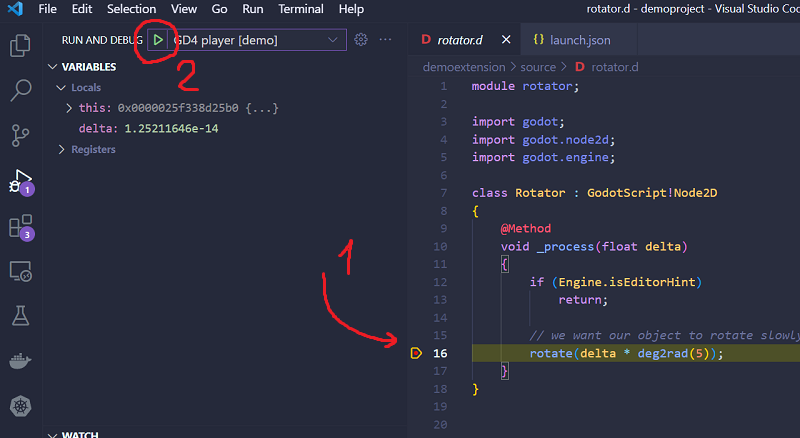
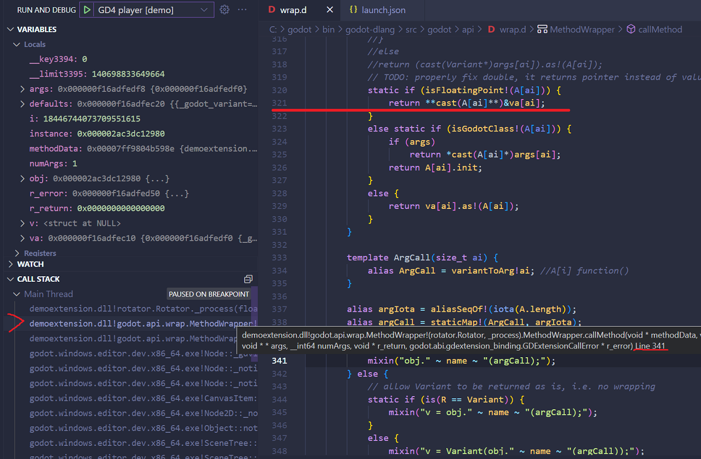
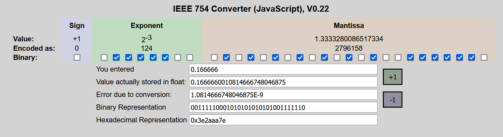

# Debugging

In the last chapter we built our first GDExtension and script class, however it has a bug and doesn't work as expected, and we don't know why.

This is why we need to use a debugger. With it we can place a breakpoint in the source code and evaluate values. Additionally when we have a crash a debugger will intercept it and pause program execution near that point.

This however only works if we have debugging information for our extensions, since we've built our extension in debug mode (default in D), it should have enough data to debug our extension.

In this chapter we will use VSCode interface to debug our extension, though many advanced users might prefer using gdb command-line interface directly in terminal, this might have some extra features but is out of scope of this guide.

## Configuring VSCode debugger

In order to debug our extension we first need to configure VSCode for that task.

Open up debug panel on the left side of VSCode, and click small gear arrow on top of debug panel header,  then choose create new configuration and select D (code-d), VSCode will create a new debugging task for you.

Now open up this task, which is in `./vscode/launch.json` file, and add launch tasks for your OS, here we create two configuration, one for editor mode and one for play mode.

Notice that editor args points to a .godot project file, while player args specifies --path and folder with .godot project file.

Also note that for Windows we choose `cppvsdbg` debugger type, which is a Visual Studio debugger for VSCode on Windows, but will run gdb on Linux.

Additionally "program" field expects absolute path to an executable your want to debug.
In this case we want to debug godot which will load our extension.

__.vscode/launch.json__: Windows launch debugger tasks
```json
{
    "version": "0.2.0",
    "configurations": [
		{
			"name": "GD4 editor [demo]",
			"type": "cppvsdbg",
			"request": "launch",
			"program": "C:/godot/bin/godot.windows.x86_64.exe",
			"args": ["${workspaceFolder}/project.godot"],
			"stopAtEntry": false,
			"cwd": "${workspaceFolder}",
			"environment": [],
			"console": "internalConsole"
		},
		{
			"name": "GD4 player [demo]",
			"type": "cppvsdbg",
			"request": "launch",
			"program": "C:/godot/bin/godot.windows.editor.dev.x86_64.exe",
			"args": ["--path", "${workspaceFolder}"],
			"stopAtEntry": false,
			"cwd": "${workspaceFolder}",
			"environment": [],
			"console": "internalConsole"
		}
	]
}
```

__.vscode/launch.json__: Linux launch debugger tasks
```json
{
    "version": "0.2.0",
    "configurations": [
		{
			"name": "Linux (test project) GD4 editor",
			"type": "lldb",
			"request": "launch",
			"program": "/home/username/godot/godot.linuxbsd.editor.dev.x86_64",
			"args": ["${workspaceFolder}/project.godot"],
			"cwd": "${workspaceFolder}",
			"console": "internalConsole"
		},
		{
			"name": "Linux (test project) GD4 instance",
			"type": "code-d",
			"request": "launch",
			"program": "/home/username/godot/godot.linuxbsd.editor.dev.x86_64",
			"args": ["--path", "${workspaceFolder}"],
			"cwd": "${workspaceFolder}",
			"console": "internalConsole"
		}
	]
}
```

## Let's debug

Now everything should be set up and we are ready to launch and debug our project.

Because our extension "mostly works", if we just run debugging we won't see anything special, unfortunately in such cases we have to thoroughly step through our program and think what could go wrong.
The only thing we can do is to validate that after each step our values are within expected range, every variable is initialized, has meaningful parameters and so on.

In this case we know that this is a bug on our side and not Godot's fault, we could check that by going to Godot editor and recreate this simple script, attach it to a component and observe that it works as expected. This exercise is left to the reader to try on their own.

Here is an example script, replace buggy Rotator with Node2D and attach this script to see if it works as expected.

__rotate.gd__:
```python
extends Node2D

func _process(delta):
	rotate(deg_to_rad(5) * delta)
```

Ok, let's switch to Visual Studio Code.

Now since we confirmed that this behavior works in gdscript we can start debugging by placing breakpoints in our D code in places that might potentially have issues. Since we are dealing with pretty specific well known functionality, after all we basically have only one line of code, we can place breakpoint on exactly that line by clicking on the gutter line left of line number.

__src/rotator.d__: inside `_process(float delta)` function
```d
rotate(delta * deg2rad(5));
```

Ok, now everything is ready. Let's pick the play mode launch task and click that small 'play' triangle button in the debug panel header.



The debugger should pause godot when it reaches that line of code.
We can now inspect our D object, and if needed navigate through the function call stack until we tracked down a problem.

Look, our delta here contains some crazy large (or small) value, something like 6.2e318, umm what??? This is some crazy big value with well over 300 zeroes, does it even have a name? How would one even pronounce that?

We clearly see why our script is not working correctly. It is because the rotate function receives some meaningless value.

We still don't know why this is happening though, so now let's open call stack on the left side of debugging panel and click next function in the list. And just like last time inspect that values are within normal range. 

Note that on Windows and Linux you will see different call stacks because of different supported levels.

In my case I see that it calls wrap.d line 341, on Linux however you might see more relevant call inside variantToArg() function above at line 321.



Let's take a look at this line of code

__src/godot/api/wrap.d__: Debugger shows execution has stepped inside this call before reaching our function
```d
static if (isFloatingPoint!(A[ai])) {
	return **cast(A[ai]**)&va[ai];
}
```

{{ TODO: video showing step by step debugging, until wrap.d variantToArg() function  }}

Ok, we have reached boundary of our D code. if the problem is outside of scope of this function we will have to build Godot debug version manually to trace the code into Godot itself. However in this example we specifically chose a situation in D code to demonstrate that sometimes we have not so obvious bugs that requires knowledge of low level system internals.

As you can see we have a special condition for floating points. We take the `va` pointer which points to Godot memory and this code converts that pointer to our float delta parameter, simple.
Except "the devs" probably messed up and so we are also now have messed delta value.

Let's try to see what it is even points to...
First let's see what's the address it is pointing too.
```c
(float*) va[0]
0x000000f16adfedf0 {3.19263142e+27}
```
Ok, that doesn't look like a valid pointer value, unless of course Godot is using an allocator with some interesting allocation strategy.

### Quick IEEE 774 floating-point introduction

In some cases you might even see that it starts with 3f*** blah blah blah zero zero zero.
Have you ever looked at how floating point values encoded in computer memory? I mean the IEEE 754 standard.

If yes... well you should be familiar that a value of 1.0 in hex will look this `0x3F800000`.
Let's google up some IEEE 754 calculator and see what our expected value might look like.

I've used this one https://www.h-schmidt.net/FloatConverter/IEEE754.html
but there might be some better calculators and the ones that supports double precision as well.

So since we are dealing with delta frame time and our game is supposedly running 60 FPS, let's do 1/60 = 0.166666... which is something like `0x3E2AAA7E` for 32 bit float and something like `0x3FC5551D68C692F7` in 64 bit float aka double precision.

Here I typed in 0.16666 and this is how I got these hex values.



Why bother with it? 
Well, we see that actual value is not even close to what we expect. We also see that the hexademical form does not seem like a floating point value either.
Excluding these cases we now need to try something else to track down the problem.

### Continue debugging

Ok let's go back to VSCode.
This time let's try that `va[0]` address and cast it to a double, in the debug output on the bottom jump to input field and try this expression. 
_(with GDB/LLDB you might need to prepend evaluation with `p`)_

```c++
*(double*) va[0]
```
And the output is:
> 0.13066833333

Yay! 
We have a reasonable value here. The actual value depends on your computer speed, since this is the delta time between this frame and the last frame. In this case specifically we have just launched our game and this is the first time `_process` is called in our game. In other words, we are in the second game frame from the beginning!

{{ a video showing whole process of trying to see what va points to }}

And that means we've just found a bug!

We'll fix this bug in the next chapter.
