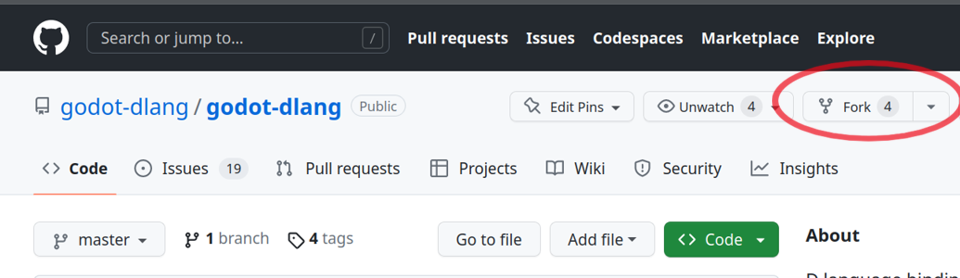
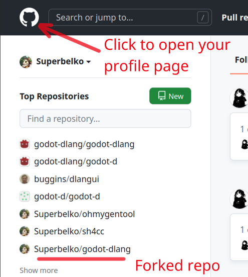
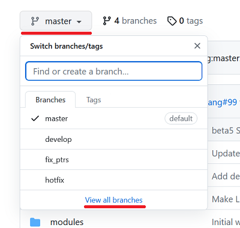
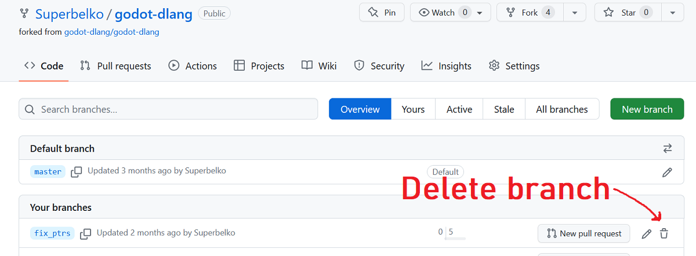

# Contributing

We did a lot of work, debugging is no fun, we spend lots of time figuring out what might go wrong, tried different options and finally we were able to track down the bug, it is now time to fix it.

In this chapter we will fix the bug, we then verify that this bug no longer affects our script and the fix itself doesn't causes further issues, after that we are ready to commit our fix and push it to github where we will open a pull request to merge our fixes into main repository.

## Fix bugs

Quick recap: 
We have seen that our delta contains garbage, but if we instead try a pointer to a double it points to correct value, therefore a problem must been with incorrect type conversion!

Okay, now we know the cause of our bug, we can now fix it.

A naive approach would be to just replace this line with a cast to double pointer and dereferencing it.

While that might work in this situation we must be careful on how we "fix" things. It is very easy to cause more harm than to fix something, as no one has the full knowledge of how this tech works from end to end on every step.

Instead, we see that there is already a special case for floating point values, this should get you alarmed, it is not checking for float specifically, nor double nor real, it checks for any floating point type instead. 
There must be a reason for that choice.

So what is going on in this piece of code? This function takes Godot arguments, processes them somehow and calls D method with new parameters, simple as that despite lots of code.

Does it makes sense now as why it checks for any floating point type?
Because we can't possibly know what actual type users might have in their code, and tightening up everything to a limited set of features is not an option either.

But what is the source type of the floating point values? Can we just assume it is always double? 
No, we can't.
And the reason is that Godot now has two possible configuration options - using normal single precision floats and the double precision floats (default since Godot 4).

This means we have to deal with both situations somehow, and one of the options is to introduce a new type matching Godot floating point configuration. Luckily there is already such type - `real_t`.

It is defined in the Godot source core/math/math_defs.h and is controlled by build system such as CMake.

__godot/core/math/math_defs.h__: C++ code for the reference
```c++
/**
* The "Real" type is an abstract type used for real numbers, such as 1.5,
* in contrast to integer numbers. Precision can be controlled with the
* presence or absence of the REAL_T_IS_DOUBLE define.
*/

#ifdef REAL_T_IS_DOUBLE
typedef double real_t;
#else
typedef float real_t;
#endif
```

https://github.com/godotengine/godot/blob/44d539465acca7592e0c88748e231fe5f151da37/core/math/math_defs.h#L129-L138

At the moment of writing we have it defined wrong on the master branch.

__src/godot/api/types.d__: An incorrect definition of real_t
```d
alias real_t = float;
```

https://github.com/godot-dlang/godot-dlang/blob/577e34dfb10d5f05cffe76d8280d6cf046051fe0/src/godot/api/types.d#L138

### Finally fixing the bug

This was a long explanation already, but we showed the logic behind finding bugs and reasoning about it, Now we can finally fix it.

Note that we will now edit your local copy of godot-dlang, these changes are meant for `/home/username/godot-dlang` folder.

First, let's fix real_t.

__src/godot/api/types.d__: Fixed real_t with proper configuration
```d
version(SINGLE_PRECISION) {
    alias real_t = float;
} else {
	alias real_t = double;
}
```

Now let's fix the type conversion.

__src/godot/api/wrap.d__: The correct way to convert value, almost
```d
return cast(A[ai]) *cast(real_t*) &va[ai];
```

Ok, this is it. Have we fixed the bug?

No, not yet, first let's close the editor, rebuild our extension (`dub build --force`), and run the game.

{{ TODO: a video showing that our object rotating as expected }}

Yeah, we clearly fixed it.
Are we there yet?

## Testing the fix by running demo projects

As was mentioned earlier, even though we might have fixed that bug we still are not exactly sure that nothing else was broken. This is an important step, we must verify that everything is still working as expected and not just the fix.

So let's do a test run for demo projects.

Since we have local godot-dlang working copy we should be able to simply run dub inside it to build stuff, we then however have to manually open Godot and try projects.

At the moment of writing that step is now automated yet, very frustrating :(

First let's switch directory in terminal to a local godot-dlang

```sh
$ cd /home/username/godot-dlang
```

Ok great, let's build the demo projects. 

We are using force flag because if we changed the templated stuff such changes very likely won't be detected by a simple timestamps change tracking mechanism of dub. 
So a full rebuild is required.

Also note that we don't specify the full package name and only the subpackage is selected.
This is because otherwise dub will fetch godot-dlang from online package registry, but we are interesting in working with local repo.

```sh
$ dub build :test --force
```

```sh
$ dub build :asteroids --force
```

Now that everything is ready we can open up Godot, choose open project, navigate to that project locations, see that editor works, click play, see that play mode works. Now repeat the same process for asteroids demo, and finally if everything is Ok we can call it fixed.

## Preparing for commit

Normal GitHub workflow requires you to fork a target repo that you want to contribute to. In order to submit your changes you will need to make a fork of godot-dlang. You can then clone your own fork, update it and push the changes to a forked repo, after that you can open a pull request so the authors of original project can merge them changes.

Here is a short overview of the process:
- Clone (or pull latest changes) from original repository
- Fork it on GitHub
- Modify it, this is usually a bug fix but can be an entirely new feature
- Commit your changes
- Push it to your fork
- Open pull request

### Forking the repo

We have now both your demo extension working and godot-dlang sample projects working, we are now almost ready to commit the changes and push it to github.

But first you will need to make github fork, so go to the github and click fork button on the top
https://github.com/godot-dlang/godot-dlang



After that you can find your own forked repo under user profile page on the left just below your name, if you have lot's of repos use a search of click "show more" button.




### Configure git author info

This is a one time process, in order to tell who has made the changes git needs to know author name and email. Since this information is public you might want to use a nickname and pseudo email instead of your real ones to avoid unneeded spam. Let's proceed.

Now you need to set your author information in your git working copy.

How to check your git settings?

```sh
cd /home/username/godot-dlang
$ git config --list
```

This will show your username, your repo origin(where to push/pull) and some git options.

> user.name=superbelko
> user.email=me@example.com
> ...

In case your user information is missing or you want to update it, use the git config command.
There are 3 storage options, a global config that will be used for every repo by default, a system config (per user override at `$HOME/config/.git`), and a local per repository config file (`.git/config`) that will override previous two.

For now let's use local override to minimize potential affected scope.

```sh
$ git config --local user.name "My Name"
$ git config --local user.email "myemail@example.com"
```

Let's check if everything good, first let's check what user and email will be used.

```sh
$ git config --get user.name
$ git config --get user.email
```

You should see the previously set user name and email.

We can also inspect all entries with scope levels by adding --show-scope flag.

```sh
$ git config --show-scope --list
```

Phew, that was a lot of work for just getting started.

## Commiting the changes

Now we are finally ready to commit the changes and push them to github.

### Creating new feature branch

Before we commit we will need a new branch for our feature, even though we are only fixing a bug we still need branch and in this case a feature will be the bug fix.

It is good practice to have meaningful names for branches that have well defined role. In this example we are fixing the bug, often you will fix an already existing tracked bug and can use id from bug tracker, in such cases it is good to name your branch to reflect your intention (e.g. `issue-42` that is supposed to fix bug with id 42), or when working on a feature a short descriptive name like `more-loaders` or `refactor`.

In this example we will just use `bugfix`, so let's create a new branch and name it bugfix.

```sh
$ git checkout -b bugfix
```

Let's verify that git is on our new branch

```sh
$ git branch
```
>    master
> * bugfix

Ok, let's proceed.

### Commit changes

Let's check what files was changed since last commit

```sh
$ git status
```

We have modified src/godot/api/wrap.d and src/godot/api/types.d

Let's add the files for commit

```sh
$ git add src/godot/api/wrap.d
$ git add src/godot/api/types.d
```

And finally commit the changes and give them a descriptive message.

```sh
$ git commit -m "Fixed bug with floating point parameters"
```

Just to make sure our history is correct 

```sh
$ git log
```

Press `q` to exit log reader.

## Pushing local changes to GitHub

Now you need to push your changes, because you are not allowed to push directly to the godot-dlang main repository you have to push changes to your own fork.

Let's see where git will push the changes

```sh
$ git remote -v
```

There is currently only origin that you can read but not write to.
We will need to add a new remote endpoint for git.

First go to github and copy a clone URL for your own repo, it will look like this
`https://github.com/<username>/godot-dlang.git`, for now let's call a remote `fork`

In general a command will look like
`git remote add <fork name> <url>`

Make sure to use real URL

```sh
$ git remote add myfork `https://github.com/<username>/godot-dlang.git`
```

Let's check again, and now we should see `myfork` and `origin` remotes

```sh
$ git remote -v
```

Finally we can push changes to `myfork` from the previous step.

```sh
$ git push myfork
```

Note that this service information is stored locally and will not be pushed over to github.

## Open pull request

Now that the commit is on GitHub we can finally open a pull request so the godot-dlang maintainers can verify and approve changes and finally merge pull request or provide a feedback if something still needs to be improved.

{{ TODO: screenshot showing how to open pull request on github }}

## Working with feedback

If your pull request was accepted you are good, however you should also read this paragraph before finishing this tutorial.

It is often the case that your changes have some issues revealed by review. Project authors will generally point out how to fix the problems that were not expected to be present at all.

Follow the tips and fix the problems, then you can then commit again and push. Because the pull request is already tracked, maintainers should see your new commit automatically.


## Clean-up

**After your changes have been merged with the main repo** you can go to your fork on github, look at the branches list and remove the no longer needed feature branch. This action will not affect the main godot-dlang repo. 

Be careful not to delete your branch before the pull request is merged!

After that you can sync your fork to keep it up to date just in case.





## Congratulations

Congratulations on your first pull request!

We are hoping you now understand the process and will consider helping us make godot-dlang better.

To get more familiar dealing with godot-dlang internals we also have basic overview of architecture which you can find [here](006_Architecture-Overview)

Please refer to the contributing document for the rules before contributing. Some changes will not be accepted. New complex features will require a discussion before such changes might be accepted.

https://github.com/godot-dlang/godot-dlang/blob/master/CONTRIBUTING.md
