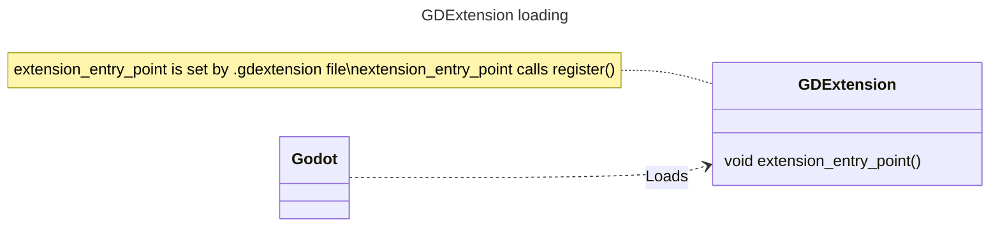

# Architecture Overview

This document shows common building blocks and their relationships upon which D extension is built.

## Loading GDExtension

Because GDExtension is implemented as a shared library it is Godot who is responsible for loading extensions. The engine will scan `.gdextension` assets and load corresponding libraries by calling the entry point defined in .gdextension file.

In godot-dlang specifically this entry point is defined by `GodotNativeLibrary` mixin.

## Building blocks

There are two packages in godot-dlang, `abi` and `api`.

The `abi` package contains low-level definitions required to talk to Godot from D code, in user scripts it is very unlikely you will need to use this package directly, instead it is used by `api` package and the binding generator.

The `api` package makes transparent as possible interaction between the D code and the Godot. It contains some of the Godot core type wrappers such as `Variant` or `String`.

Most user scripts however will only use attributes from it (i.e. `@Method`), the special `GodotNativeLibrary` mixin, and the bindings.

### Module Roles

When Godot calls that entry point godot-dlang will register marked user types by using special CTFE introspection mechanism defined in `src/godot/api/register.d` module.
*You can think of this step as a declaration, it only tells Godot what types and methods this extension provides.*

User classes are only exposed by `GodotNativeLibrary`, then `register.d` will scan specified types for additional attributes and automatically decide what to expose.

It then uses `src/godot/api/wrap.d` on user scripts and types to wrap these types so Godot can call them and D can reply back. 

User types are either wrapped with the help of `Variant` or directly implemented by GDExtension interface in `src/godot/abi/gdextension_binding.d` (or ImportC header counterpart).

Generated bindings are usually wrapped by `src/godot/api/bind.d`, this module handles type conversion between Godot engine and D code, usually through `Variant` type.

The resulting architecture looks a bit messy, it looks like there is clean distinction between Variant, wrap.d, bind.d, etc... However they are quite intertwined.

Here is an overview of what it looks like, `GodotNativeLibrary` is like an entry point from the look of it Variant is the leaf building block.

In this graph "User Scripts" is a custom D scripts like the Rotator in this tutorial, and "Godot Classes" are the generated bindings from `extension_api.json`.

```mermaid
---
title: godot-dlang modules overview
---
graph LR;
    GodotNativeLibrary -- Invokes --> register.d;
    register.d -- Wraps User Types --> wrap.d;
    register.d -- Reflects User Types --> uda.d;
    bind.d -- Uses --> variant.d;
    wrap.d -- Uses --> variant.d;
    UserScripts[User Scripts] -- Exposed with --> register.d;
    GodotClasses[Godot Classes] -- Wraps Bindings --> bind.d;

	classDef start fill:#1D3318,stroke:#333333,stroke-width:4px;
	class GodotNativeLibrary start
```

